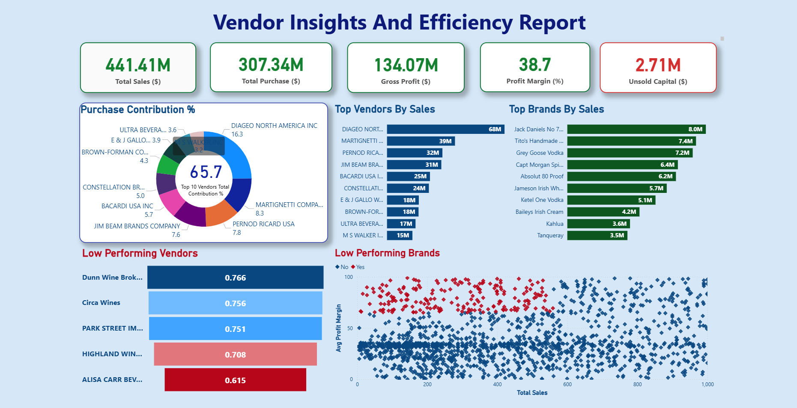

# Vendor Insights and Efficiency Analysis

**Tools Used:** SQL • Python (Pandas, Matplotlib, SQLite3) • Power BI  

---

## 📘 Project Overview
Effective inventory and sales management are essential for improving profitability in the retail and wholesale sector.  
This project analyzes **vendor performance and operational efficiency** using SQL, Python, and Power BI to deliver insights that help optimize purchasing and inventory strategies.

---

## 🎯 Objectives
1. Identify underperforming brands that require pricing or promotional adjustments.  
2. Determine top vendors contributing to sales and gross profit.  
3. Analyze the impact of bulk purchasing on unit costs.  
4. Evaluate inventory turnover to reduce holding costs and improve efficiency.  
5. Examine profitability variance between high- and low-performing vendors.  

---

## 🧠 Business Context
A retail company purchases products from multiple vendors and sells them through various stores.  
Management wants to identify:
- Which vendors consistently deliver value and profit.  
- Which vendors create inefficiencies or losses.  
- How purchasing volume and delivery timing affect margins and inventory levels.

The analysis delivers actionable insights for procurement and business strategy.

---

## 📂 Data Overview
| Dataset | Description |
|----------|--------------|
| `purchases.csv` | Vendor purchase transactions |
| `purchase_prices.csv` | Reference vendor price list |
| `vendor_invoice.csv` | Invoice and freight details |
| `begin_inventory.csv` / `end_inventory.csv` | Opening and closing inventory snapshots |
| `sales.csv` | Retail sales data |

> ⚠️ Original datasets (multi-GB scale) are **not included** to keep the repository lightweight.  
> Sample data and full analysis logic are included for reference.

---

## 🧩 Project Workflow
1. **Data Ingestion** – Loaded datasets into SQLite using Python (`sqlite3`).  
2. **Data Cleaning** – Formatted dates, handled missing values, and removed duplicates.  
3. **SQL Analysis** – Joined purchase, sales, and vendor data to compute cost, margin, and delivery metrics.  
4. **Python EDA** – Visualized patterns with Pandas, Matplotlib, and Seaborn.  
5. **Power BI Dashboard** – Built an interactive report titled **“Vendor Insights and Efficiency Report.”**  
6. **Reporting** – Summarized findings in a business report with recommendations.

---

## 📊 Key Performance Indicators (KPIs)
| KPI | Description |
|-----|--------------|
| **Gross Margin %** | (Sales − Purchase Cost) ÷ Sales × 100 |
| **On-Time Delivery %** | Percentage of orders delivered before or on expected date |
| **Inventory Turnover** | Sales ÷ Average Inventory |
| **Cost Accuracy %** | Vendor invoice accuracy against agreed purchase price |
| **Freight Cost %** | Freight ÷ Purchase Cost × 100 |

---

## 💡 Insights
- Some vendors consistently delivered late, increasing holding and operational costs.  
- Bulk purchasing reduced per-unit costs for high-demand products.  
- A few vendors contributed a majority of profit → potential dependency risk.  
- Underperforming brands showed low sales with high closing stock → require promotion or discounting.  

---

## 🖥 Dashboard Preview
### Vendor Insights and Efficiency Report  

> The Power BI dashboard provides a unified view of sales, purchasing, and vendor performance with interactive filters and KPIs.

---

## 🧾 Report
📄 [View Full Report (PDF)](Vendor%20Performance%20Report.pdf)

> The report summarizes key findings, methodology, and recommendations for vendor and inventory performance optimization.

---

